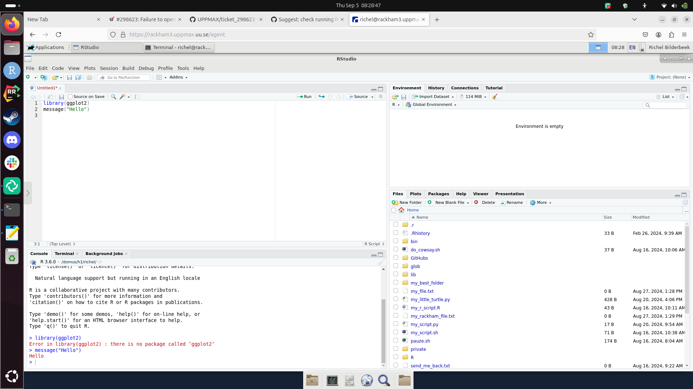
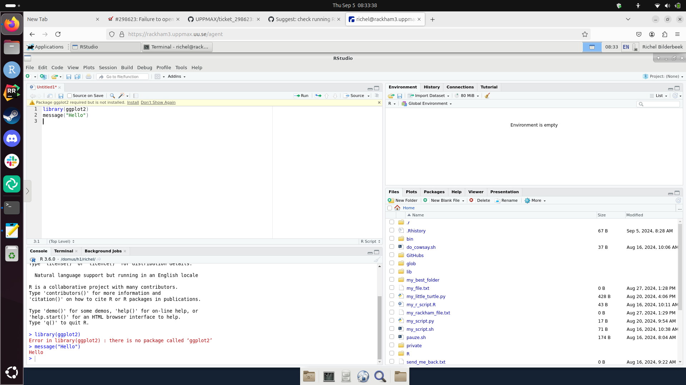
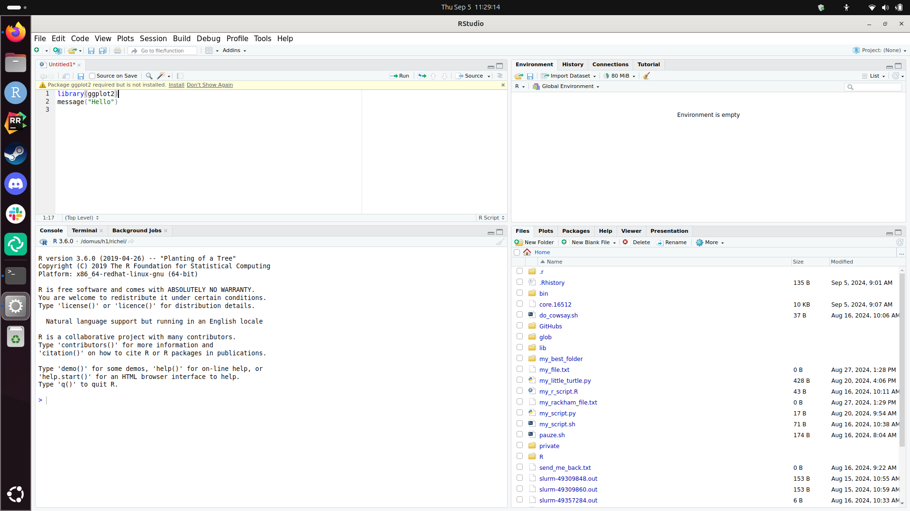
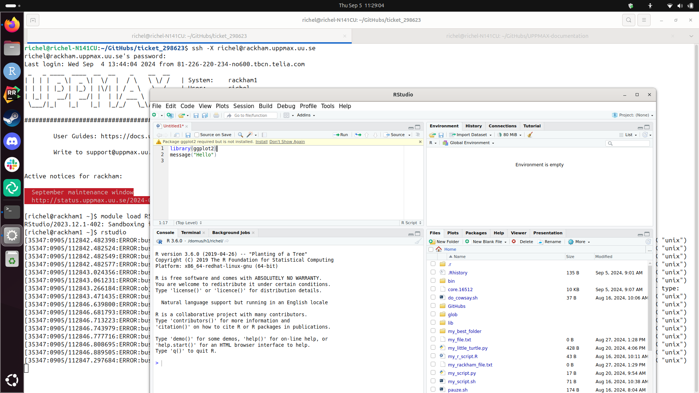
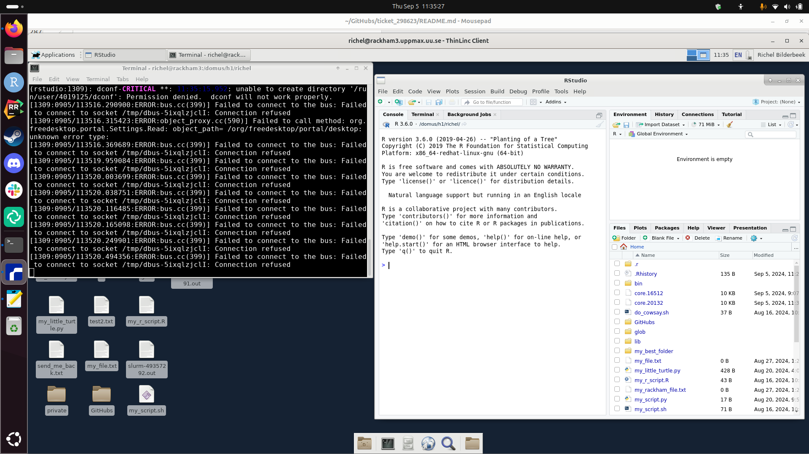
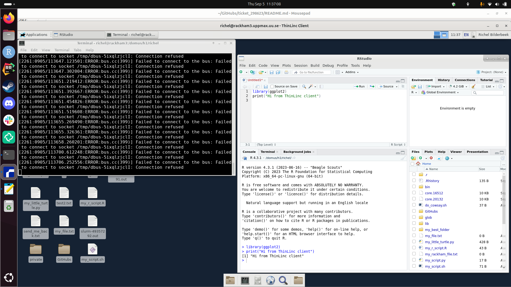

# ticket_298623

Notes for ticket 298623, related to [UPPMAX documentation #126](https://github.com/UPPMAX/UPPMAX-documentation/issues/126).


## Comms

```

Unfortunately, after allocating a node using the official documentation also results in the same error:

[cid:image001.png@01DB0042.0A789DC0]


Regarding your questions:
- Which operating system do you have?
I’m using Apple macOS.
- Can you run the program `xeyes` (UPPMAX documentation at
https://docs.uppmax.uu.se/software/xeyes/ ) successfully?
Yes.
- What are the exact `salloc` and `ssh` commands you use?
I’m using the following workflow:

Allocate a node, and then ssh into it.
salloc -A naiss2024-22-52 -p core -n 5 -t 9:30:00 --no-shell

The output is:
"salloc: Granted job allocation 42599833
salloc: Waiting for resource configuration
salloc: Nodes r485 are ready for job"

Then ssh into the node you got. Here I got r485.
ssh -X r485

Load bioinformatic tools:
module load bioinfo-tools

Load R packages:
module load R_packages

Load R Studio:
module load RStudio

Open R Studio:
rstudio

- What are the exact modules you load? Note that only loading the `RStudio`
module was recommended incorrectly!

See above for the modules that I always load before starting my analysis.


Also I have another problem: Since I migrated my data to Dardel and started to login via the local Thinlinc application, I can’t login to Rackham anymore since the interface changed to the one before.

Specifically, previously I was used to this window:
[cid:image002.png@01DB0043.103020C0]

However, now the window looks like this and I can’t find the area to put my password when I want to login to Rackham:
[cid:image003.png@01DB0043.2B23D8E0]

If that problem is solved I can also try to run the pipeline on the local ThinLinc instead of the web application, maybe this helps solving the Rstudio problem.

Also, I would be up for meeting at 15:00 today if the problems still persist.
```

## Suggested solution

Use:

```bash
interactive -A sens2023598 -n 2 -t 8:00:00
module load R/4.3.1 R_packages/4.3.1 RStudio/2023.12.1-402
rstudio
```

## Investigation

Hypothesis: not all RStudio versions work,
user needs to load the one that is documented to work.

Questions:

- Does RStudio/2023.06.2-561 indeed work as documented?
  - Does loading this module also load R?
  - Does loading this module also load R_packages?
- Does the newer RStudio/2023.12.1-402 also works in the same way?
  - Does loading this module also load R?
  - Does loading this module also load R_packages?
- Does the `salloc` way of the user work?
- Is the local ThinLinc client a problem?

Questions with answers:

- Does RStudio/2023.06.2-561 indeed work as documented? No
  - Does loading this module also load R? No
  - Does loading this module also load R_packages? No
- Does the newer RStudio/2023.12.1-402 also works in the same way? Yes
  - Does loading this module also load R? No
  - Does loading this module also load R_packages? No

## Procedures

### Subquestion 1a, the (incorrect?) UPPMAX doc approach for RStudio/2023.06.2-561:

- Start rackham-gui.uppmax.uu.se
- Start an `interactive` session with 2 nodes (user uses 5, but 2 should work too)

```bash
interactive -t 2:00:00 -n 2 -A staff
```

- Load the RStudio/2023.06.2-561 module, without R and without R_Packages

```
module load RStudio/2023.06.2-561
```

Gives:

```
[richel@r210 richel]$ module load RStudio/2023.06.2-561
RStudio/2023.06.2-561: Sandboxing is not enabled for RStudio at UPPMAX. See 'module help RStudio/2023.06.2-561' for more information

[richel@r210 richel]$ module list

Currently Loaded Modules:
  1) uppmax   2) PostgreSQL/10.3   3) RStudio/2023.06.2-561
```


- Obtain the R version

```
[richel@r210 richel]$ module load RStudio/2023.06.2-561
RStudio/2023.06.2-561: Sandboxing is not enabled for RStudio at UPPMAX. See 'module help RStudio/2023.06.2-561' for more information
[richel@r210 richel]$ R --version
R version 3.6.0 (2019-04-26) -- "Planting of a Tree"
Copyright (C) 2019 The R Foundation for Statistical Computing
Platform: x86_64-redhat-linux-gnu (64-bit)

R is free software and comes with ABSOLUTELY NO WARRANTY.
You are welcome to redistribute it under the terms of the
GNU General Public License versions 2 or 3.
For more information about these matters see
https://www.gnu.org/licenses/.
```

- Check if packages are installed
- Start RStudio, record errors

```
[richel@r210 richel]$ rstudio
[10829:0905/082808.948237:ERROR:bus.cc(399)] Failed to connect to the bus: Failed to connect to socket /tmp/dbus-5ixqlzjclI: Connection refused
[10829:0905/082808.948688:ERROR:bus.cc(399)] Failed to connect to the bus: Failed to connect to socket /tmp/dbus-5ixqlzjclI: Connection refused
[10829:0905/082809.562579:ERROR:bus.cc(399)] Failed to connect to the bus: Failed to connect to socket /tmp/dbus-5ixqlzjclI: Connection refused
[10829:0905/082809.637181:ERROR:bus.cc(399)] Failed to connect to the bus: Failed to connect to socket /tmp/dbus-5ixqlzjclI: Connection refused
[10883:0905/082809.818860:ERROR:gpu_memory_buffer_support_x11.cc(49)] dri3 extension not supported.
[10829:0905/082810.073515:ERROR:bus.cc(399)] Failed to connect to the bus: Failed to connect to socket /tmp/dbus-5ixqlzjclI: Connection refused
[10829:0905/082813.962082:ERROR:bus.cc(399)] Failed to connect to the bus: Failed to connect to socket /tmp/dbus-5ixqlzjclI: Connection refused
[10829:0905/082814.009277:ERROR:bus.cc(399)] Failed to connect to the bus: Failed to connect to socket /tmp/dbus-5ixqlzjclI: Connection refused
[10829:0905/082814.065842:ERROR:bus.cc(399)] Failed to connect to the bus: Failed to connect to socket /tmp/dbus-5ixqlzjclI: Connection refused
[10829:0905/082814.101876:ERROR:bus.cc(399)] Failed to connect to the bus: Failed to connect to socket /tmp/dbus-5ixqlzjclI: Connection refused
[10829:0905/082814.173446:ERROR:bus.cc(399)] Failed to connect to the bus: Failed to connect to socket /tmp/dbus-5ixqlzjclI: Connection refused
[10829:0905/082814.245107:ERROR:bus.cc(399)] Failed to connect to the bus: Failed to connect to socket /tmp/dbus-5ixqlzjclI: Connection refused
[10829:0905/082814.257955:ERROR:bus.cc(399)] Failed to connect to the bus: Failed to connect to socket /tmp/dbus-5ixqlzjclI: Connection refused
[10829:0905/082814.363277:ERROR:bus.cc(399)] Failed to connect to the bus: Failed to connect to socket /tmp/dbus-5ixqlzjclI: Connection refused
[10829:0905/082814.502333:ERROR:bus.cc(399)] Failed to connect to the bus: Failed to connect to socket /tmp/dbus-5ixqlzjclI: Connection refused
[10829:0905/082814.688413:ERROR:bus.cc(399)] Failed to connect to the bus: Failed to connect to socket /tmp/dbus-5ixqlzjclI: Connection refused
[10829:0905/082841.608768:ERROR:bus.cc(399)] Failed to connect to the bus: Failed to connect to socket /tmp/dbus-5ixqlzjclI: Connection refused
[10829:0905/082841.718912:ERROR:bus.cc(399)] Failed to connect to the bus: Failed to connect to socket /tmp/dbus-5ixqlzjclI: Connection refused
[10829:0905/082844.121524:ERROR:bus.cc(399)] Failed to connect to the bus: Failed to connect to socket /tmp/dbus-5ixqlzjclI: Connection refused
[richel@r210 richel]$ 
```



 

### Subquestion 1b, the (incorrect?) UPPMAX doc approach for RStudio/2023.12.1-402


```
module load RStudio/2023.12.1-402
module list
```

```
[richel@r210 richel]$ module load RStudio/2023.12.1-402
RStudio/2023.12.1-402: Sandboxing is not enabled for RStudio at UPPMAX. See 'module help RStudio/2023.12.1-402' for more information
[richel@r210 richel]$ module list

Currently Loaded Modules:
  1) uppmax   2) PostgreSQL/10.3   3) RStudio/2023.12.1-402

```

```
[richel@r210 richel]$ R --version
R version 3.6.0 (2019-04-26) -- "Planting of a Tree"
Copyright (C) 2019 The R Foundation for Statistical Computing
Platform: x86_64-redhat-linux-gnu (64-bit)

R is free software and comes with ABSOLUTELY NO WARRANTY.
You are welcome to redistribute it under the terms of the
GNU General Public License versions 2 or 3.
For more information about these matters see
https://www.gnu.org/licenses/.
```

```
[richel@r210 richel]$ rstudio
[11637:0905/083327.797032:ERROR:bus.cc(399)] Failed to connect to the bus: Failed to connect to socket /tmp/dbus-5ixqlzjclI: Connection refused
[11637:0905/083327.797233:ERROR:bus.cc(399)] Failed to connect to the bus: Failed to connect to socket /tmp/dbus-5ixqlzjclI: Connection refused
[11637:0905/083327.797295:ERROR:bus.cc(399)] Failed to connect to the bus: Failed to connect to socket /tmp/dbus-5ixqlzjclI: Connection refused
[11637:0905/083327.797360:ERROR:bus.cc(399)] Failed to connect to the bus: Failed to connect to socket /tmp/dbus-5ixqlzjclI: Connection refused

(rstudio:11637): dconf-CRITICAL **: 08:33:28.519: unable to create directory '/run/user/4019125/dconf': Permission denied.  dconf will not work properly.

(rstudio:11637): dconf-CRITICAL **: 08:33:28.545: unable to create directory '/run/user/4019125/dconf': Permission denied.  dconf will not work properly.
[11637:0905/083328.547302:ERROR:bus.cc(399)] Failed to connect to the bus: Failed to connect to socket /tmp/dbus-5ixqlzjclI: Connection refused

(rstudio:11637): dconf-CRITICAL **: 08:33:28.549: unable to create directory '/run/user/4019125/dconf': Permission denied.  dconf will not work properly.
[11637:0905/083328.599437:ERROR:bus.cc(399)] Failed to connect to the bus: Failed to connect to socket /tmp/dbus-5ixqlzjclI: Connection refused
[11637:0905/083328.741175:ERROR:object_proxy.cc(590)] Failed to call method: org.freedesktop.portal.Settings.Read: object_path= /org/freedesktop/portal/desktop: unknown error type: 
[11637:0905/083328.886902:ERROR:bus.cc(399)] Failed to connect to the bus: Failed to connect to socket /tmp/dbus-5ixqlzjclI: Connection refused
[11637:0905/083332.159845:ERROR:bus.cc(399)] Failed to connect to the bus: Failed to connect to socket /tmp/dbus-5ixqlzjclI: Connection refused
[11637:0905/083332.204327:ERROR:bus.cc(399)] Failed to connect to the bus: Failed to connect to socket /tmp/dbus-5ixqlzjclI: Connection refused
[11637:0905/083332.263417:ERROR:bus.cc(399)] Failed to connect to the bus: Failed to connect to socket /tmp/dbus-5ixqlzjclI: Connection refused
[11637:0905/083332.310827:ERROR:bus.cc(399)] Failed to connect to the bus: Failed to connect to socket /tmp/dbus-5ixqlzjclI: Connection refused
[11637:0905/083332.339524:ERROR:bus.cc(399)] Failed to connect to the bus: Failed to connect to socket /tmp/dbus-5ixqlzjclI: Connection refused
[11637:0905/083332.442935:ERROR:bus.cc(399)] Failed to connect to the bus: Failed to connect to socket /tmp/dbus-5ixqlzjclI: Connection refused
[11637:0905/083332.478774:ERROR:bus.cc(399)] Failed to connect to the bus: Failed to connect to socket /tmp/dbus-5ixqlzjclI: Connection refused
[11637:0905/083332.605164:ERROR:bus.cc(399)] Failed to connect to the bus: Failed to connect to socket /tmp/dbus-5ixqlzjclI: Connection refused
[11637:0905/083332.775689:ERROR:bus.cc(399)] Failed to connect to the bus: Failed to connect to socket /tmp/dbus-5ixqlzjclI: Connection refused
[11637:0905/083332.956050:ERROR:bus.cc(399)] Failed to connect to the bus: Failed to connect to socket /tmp/dbus-5ixqlzjclI: Connection refused
[11637:0905/083334.766375:ERROR:bus.cc(399)] Failed to connect to the bus: Failed to connect to socket /tmp/dbus-5ixqlzjclI: Connection refused
[11637:0905/083337.145918:ERROR:bus.cc(399)] Failed to connect to the bus: Failed to connect to socket /tmp/dbus-5ixqlzjclI: Connection refused
[richel@r210 richel]$ 
```




## No modules

System R version is version 3.6.0 (from 2019-04-26):

```
[richel@rackham3 richel]$ module list

Currently Loaded Modules:
  1) uppmax

 

[richel@rackham3 richel]$ R --version
R version 3.6.0 (2019-04-26) -- "Planting of a Tree"
Copyright (C) 2019 The R Foundation for Statistical Computing
Platform: x86_64-redhat-linux-gnu (64-bit)

R is free software and comes with ABSOLUTELY NO WARRANTY.
You are welcome to redistribute it under the terms of the
GNU General Public License versions 2 or 3.
For more information about these matters see
https://www.gnu.org/licenses/.
```

## R versions

```
[richel@r210 richel]$ module spider R

----------------------------------------------------------------------------
  R:
----------------------------------------------------------------------------
     Versions:
        R/3.0.2
        R/3.2.3
        R/3.3.2
        R/3.4.0
        R/3.4.3
        R/3.5.0
        R/3.5.2
        R/3.6.0
        R/3.6.1
        R/4.0.0
        R/4.0.4
        R/4.1.1
        R/4.2.1
        R/4.3.1
        R/4.3.2
     Other possible modules matches:
        454-dataprocessing  ADMIXTURE  ANTLR  ARCS  ARC_assembler  ARPACK-NG  ..
.
```

## R_packages

```
[richel@r210 richel]$ module spider R_packages

----------------------------------------------------------------------------
  R_packages:
----------------------------------------------------------------------------
     Versions:
        R_packages/3.3.0
        R_packages/3.3.1
        R_packages/3.3.2
        R_packages/3.4.0
        R_packages/3.4.3
        R_packages/3.5.0
        R_packages/3.5.2
        R_packages/3.6.0
        R_packages/3.6.1
        R_packages/4.0.0
        R_packages/4.0.4
        R_packages/4.1.1
        R_packages/4.2.1
        R_packages/4.3.1

----------------------------------------------------------------------------
  For detailed information about a specific "R_packages" package (including how 
to load the modules) use the module's full name.
```

## RStudio versions

```
[richel@r210 richel]$ module spider Rstudio

----------------------------------------------------------------------------
  RStudio:
----------------------------------------------------------------------------
     Versions:
        RStudio/1.0.136
        RStudio/1.0.143
        RStudio/1.0.153
        RStudio/1.1.423
        RStudio/1.1.463
        RStudio/1.4.1106
        RStudio/2022.02.0-443
        RStudio/2022.02.3-492
        RStudio/2022.07.1-554
        RStudio/2023.06.0-421
        RStudio/2023.06.2-561
        RStudio/2023.12.1-402

----------------------------------------------------------------------------
  For detailed information about a specific "RStudio" package (including how to 
load the modules) use the module's full name.
  Note that names that have a trailing (E) are extensions provided by other modu
les.
```

## Does the `salloc` way of the user work?

### `salloc` without X forwarding fails cleanly

```
[richel@rackham3 richel]$ salloc -t 2:00:00 -n 2 -A staff
salloc: Pending job allocation 49962252
salloc: job 49962252 queued and waiting for resources
salloc: job 49962252 has been allocated resources
salloc: Granted job allocation 49962252
salloc: Waiting for resource configuration
salloc: Nodes r1180 are ready for job
 _   _ ____  ____  __  __    _    __  __
| | | |  _ \|  _ \|  \/  |  / \   \ \/ /   | System:    r1180
| | | | |_) | |_) | |\/| | / _ \   \  /    | User:      richel
| |_| |  __/|  __/| |  | |/ ___ \  /  \    | 
 \___/|_|   |_|   |_|  |_/_/   \_\/_/\_\   | 

###############################################################################

        User Guides: https://docs.uppmax.uu.se/

        Write to support@uppmax.uu.se, if you have questions or comments.


[richel@r1180 richel]$ module load R/4.3.1 R_packages/4.3.1 RStudio/2023.12.1-402
R/4.3.1: Nearly all CRAN and BioConductor packages are installed and available by loading
the module R_packages/4.3.1 
R_packages/4.3.1: Note that loading some spatial analysis packages, especially geo-related packages, might
R_packages/4.3.1: require you to load additional modules prior to use. monocle3 is such a package. See
R_packages/4.3.1: 'module help R_packages/4.3.1'

R_packages/4.3.1: The RStudio packages pane is disabled when loading this module, due to RStudio slowdowns
R_packages/4.3.1: because there are >20000 available packages. *All packages are still available.*  For 
R_packages/4.3.1: more information and instructions to re-enable the packages pane (not recommended) see
R_packages/4.3.1: 'module help R_packages/4.3.1'

RStudio/2023.12.1-402: Sandboxing is not enabled for RStudio at UPPMAX. See 'module help RStudio/2023.12.1-402' for more information
[richel@r1180 richel]$ rstudio
[16512:0905/090818.531827:ERROR:ozone_platform_x11.cc(241)] Missing X server or $DISPLAY
[16512:0905/090818.531890:ERROR:env.cc(255)] The platform failed to initialize.  Exiting.
Segmentation fault (core dumped)
[richel@r1180 richel]$ 
```

Also, using `ssh` and `ssh -X` give different and clear error messages

## Is the local ThinLinc client a problem?



> Using `ssh sven@rackham.uppmax.uu.se` works (!)



> Using `ssh -X sven@rackham.uppmax.uu.se` works



> Using local ThinLinc, only loading `RStudio` works



> Using local ThinLinc, loading `R`, `R_packages` and `RStudio` works

